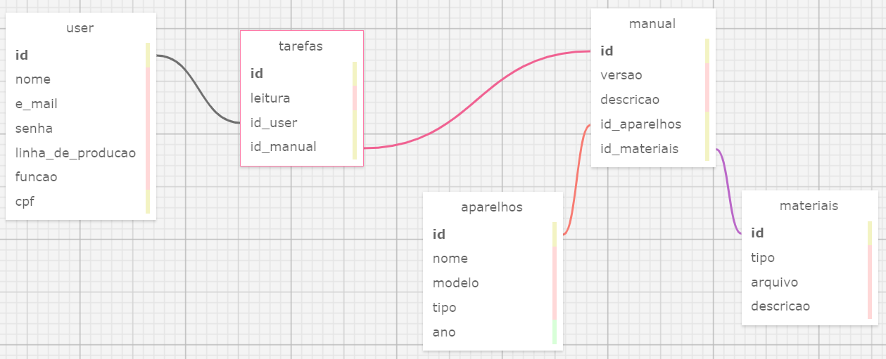

# Banco de dados

&nbsp;&nbsp;&nbsp;&nbsp; O presente modelo surge como uma proposta de banco de dados para o projeto sendo realizado em conjunto com a empresa Dell Technologies.

  Modelo 

Fonte: Material produzido pelo autor (2024). 

## Cardinalidade

User e Tarefas:
- Relação N:1;
- Existem vários usuários que podem ter vários manuais atribuídos;
- Chave primária: id (user);
- Chave estrangeira: id_user presente na tabela manuais;
 

Materiais e Manual:
- Relação N:1;
- Um material pode estar ligado a apenas um manual, mas um manual pode receber vários materiais.
- Chave primária: id (materiais);
- Chave estrangeira: id_materials presente na tabela manual;
 

Aparelhos e Manual:
- Relação N:1;
- Um parelho possui vários manuais, mas cada manual está ligado a apenas um produto;
- Chave primária: id (aparelhos);
- Chave estrangeira: id_aparelhos presente na tabela manual;
 

Manual E Tarefas:
- Relação N:1;
- Um usuário tem uma tarefa atribuída (leitura de manual) e mas vários usuários são atribuídos a uma tarefa;
- Tabela criada para associação de usuários e manuais no intuito de evitar uma relação de N:N
- O ID de cada tabela é utilizado como chave estrangeira da tabela de associação;

  ##Markdown

-- Globals
-- ---

-- SET SQL_MODE="NO_AUTO_VALUE_ON_ZERO";
-- SET FOREIGN_KEY_CHECKS=0;

-- Tabela 'user'
CREATE TABLE `user` (
  `id` INTEGER NULL AUTO_INCREMENT DEFAULT NULL,
  `nome` VARCHAR(100) NULL DEFAULT NULL,
  `e_mail` VARCHAR(100) NULL DEFAULT NULL,
  `senha` VARCHAR(100) NULL DEFAULT NULL,
  `linha_de_producao` VARCHAR(150) NULL DEFAULT NULL,
  `funcao` VARCHAR(100) NULL DEFAULT NULL,
  `cpf` INTEGER(50) NULL DEFAULT NULL,
  PRIMARY KEY (`id`)
);

-- Tabela 'manuais'
CREATE TABLE `manuais` (
  `id` INTEGER NULL AUTO_INCREMENT DEFAULT NULL,
  `leitura` VARCHAR(100) NULL DEFAULT NULL,
  `id_user` INTEGER NULL DEFAULT NULL,
  `id_manual` INTEGER NULL DEFAULT NULL,
  PRIMARY KEY (`id`)
);

-- Table 'aparelhos'
CREATE TABLE `aparelhos` (
  `id` INTEGER NULL AUTO_INCREMENT DEFAULT NULL,
  `nome` VARCHAR(100) NULL DEFAULT NULL,
  `modelo` VARCHAR(100) NULL DEFAULT NULL,
  `tipo` VARCHAR NULL DEFAULT NULL,
  `ano` YEAR(50) NULL DEFAULT NULL,
  PRIMARY KEY (`id`)
);

-- Tabela 'manual'
CREATE TABLE `manual` (
  `id` INTEGER NULL AUTO_INCREMENT DEFAULT NULL,
  `versao` VARCHAR(50) NULL DEFAULT NULL,
  `descricao` VARCHAR(900) NULL DEFAULT NULL,
  `id_aparelhos` INTEGER NULL DEFAULT NULL,
  `id_materiais` INTEGER NULL DEFAULT NULL,
  PRIMARY KEY (`id`)
);

-- Tabela 'materiais'
CREATE TABLE `materiais` (
  `id` INTEGER NULL AUTO_INCREMENT DEFAULT NULL,
  `tipo` VARCHAR(100) NULL DEFAULT NULL,
  `arquivo` VARCHAR(100) NULL DEFAULT NULL,
  `descricao` VARCHAR(900) NULL DEFAULT NULL,
  PRIMARY KEY (`id`)
);

-- Foreign Keys 
-- ---

ALTER TABLE `manuais` ADD FOREIGN KEY (id_user) REFERENCES `user` (`id`);
ALTER TABLE `manuais` ADD FOREIGN KEY (id_manual) REFERENCES `manual` (`id`);
ALTER TABLE `manual` ADD FOREIGN KEY (id_aparelhos) REFERENCES `aparelhos` (`id`);
ALTER TABLE `manual` ADD FOREIGN KEY (id_materiais) REFERENCES `materiais` (`id`);
